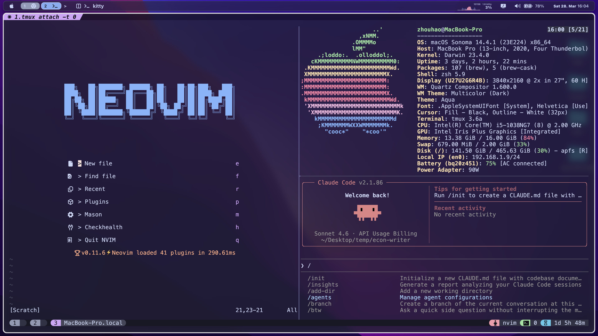
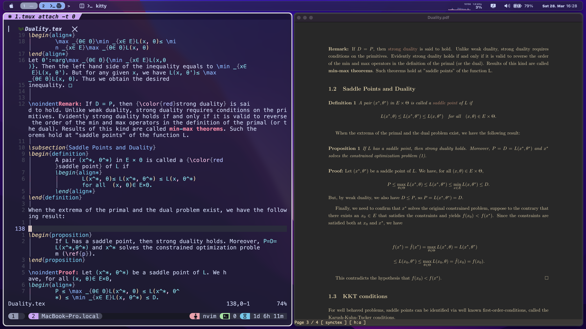
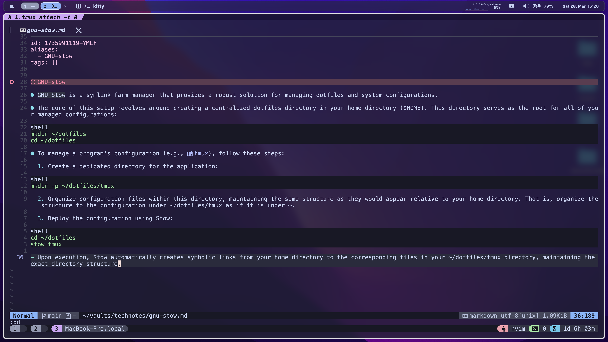

# Neovim for Theorists 🖋️

Welcome! If you are a microeconomic theorist, a mathematician, or an academic who practically lives inside LaTeX and Markdown files (with occasional dips into Python), this Neovim configuration is designed for you. 

This guide is written for users who are eager to type math and text **at the speed of thought**. 

*Note: This tutorial assumes you are using **macOS**. If you are on Linux, you are probably already familiar with these concepts and adapting this guide will be trivial. If you are a Windows user, you can use WSL (Windows Subsystem for Linux) and follow similar steps.*

---

## Some screeningshots




---

## Part 1: Installation & Setup

Before we download this configuration, we need to install Neovim and a few essential tools. We will use **Homebrew**, the standard package manager for macOS. *(If you don't have Homebrew installed, open your Terminal, visit [brew.sh](https://brew.sh), and paste their installation command first).*

### 1. Install Dependencies
Open your Terminal and run the following commands to install everything you need:

```bash
# Install Neovim itself
brew install neovim

# Install a Nerd Font (Crucial for displaying icons properly in Neovim)
brew install --cask font-hack-nerd-font
# IMPORTANT: After installing, open your terminal preferences and set your font to "Hack Nerd Font".

# Install Sioyek (A PDF viewer tailored for reading research papers and live-previewing LaTeX)
brew install --cask sioyek

# Install pngpaste (Required for pasting clipboard images directly into Markdown via the :ObsidianPasteImg command)
brew install pngpaste
```

### 2. Clone the Configuration
Neovim looks for its configuration files in a specific hidden folder on your computer (`~/.config/nvim`). We need to download (clone) this repository directly into that location.

Run these commands in your terminal:

```bash
# Create the config directory if it doesn't already exist
mkdir -p ~/.config

# Download this repository to the correct path
git clone https://github.com/haozhou32/nvim ~/.config/nvim
```

Now, simply type `nvim` in your terminal and press Enter. The configuration will automatically download and install all the necessary plugins on its first run. Let it finish processing, and then you are ready to go!

---

## Part 2: How to Use Vim

If you are coming from standard editors (like TeXShop, VSCode, or Overleaf), Vim's keyboard-driven workflow will feel like an alien landscape at first. Don't panic! It is a language, and once you learn it, you will never want to go back.

### 1. The Most Important Step: VimTutor
The absolute best way to learn Vim is by doing. Open your terminal and type:
```bash
vimtutor
```
This will launch a built-in, interactive 30-minute lesson. It teaches you the core philosophy of Vim (how to move your cursor, edit text, delete words, and save files). **Do not skip this.** It is the foundation of everything else.

### 2. Dive Deeper with This Repo's Documentation
Once you have the basics down, check out the `docs/` folder included inside this repository. I have written advanced materials and tips specific to this setup that will help you integrate Neovim seamlessly into your daily research workflow.

### 3. For the Ambitious Reader
If you want to truly master your setup, understand how it works under the hood, and customize it to your exact liking, here are the holy grails of Neovim and LaTeX:
- **[kickstart.nvim](https://github.com/nvim-lua/kickstart.nvim)**: The gold standard repository for understanding how modern Neovim configurations are built from scratch.
- **[A guide to supercharged mathematical typesetting](https://ejmastnak.com/tutorials/vim-latex/intro/)**: An incredible tutorial series by Elijan Mastnak (building on the legendary workflow of the late Gilles Castel). It will teach you how to configure Vim snippets to type LaTeX math literally as fast as you can write it by hand.

---

## Part 3: Maintaining Your Configuration

Over time, you will want to update your tools, clean up unused plugins, or add support for new programming languages. This configuration makes maintenance incredibly easy through built-in commands.

### Managing Plugins with Lazy
We use a modern plugin manager called `lazy.nvim`. To manage your Neovim plugins, simply open Neovim and type:
```vim
:Lazy
```
A sleek menu will pop up. From here, you can:
- Press `U` to **Update** your plugins to their latest versions.
- Press `X` to **Clean** (uninstall) any plugins you have removed from the configuration files.
- Press `?` for a list of all available helper commands.

### Installing Tools with Mason
To get smart autocompletion, error checking, and formatting for LaTeX, Markdown, and Python, we use a tool called Mason. Inside Neovim, type:
```vim
:Mason
```
This opens a graphical menu where you can easily browse, install, and update background tools:
- **LSPs (Language Servers):** e.g., `texlab` for LaTeX, `marksman` for Markdown, or `pyright` for Python.
- **Formatters:** e.g., `black` for Python.
- **Linters** for catching syntax errors.

Navigate the menu, press `i` to install the tools you need, and you'll be writing flawless code and papers in no time.

---
*Happy typing, and may your proofs be elegant and your compilations error-free!*
