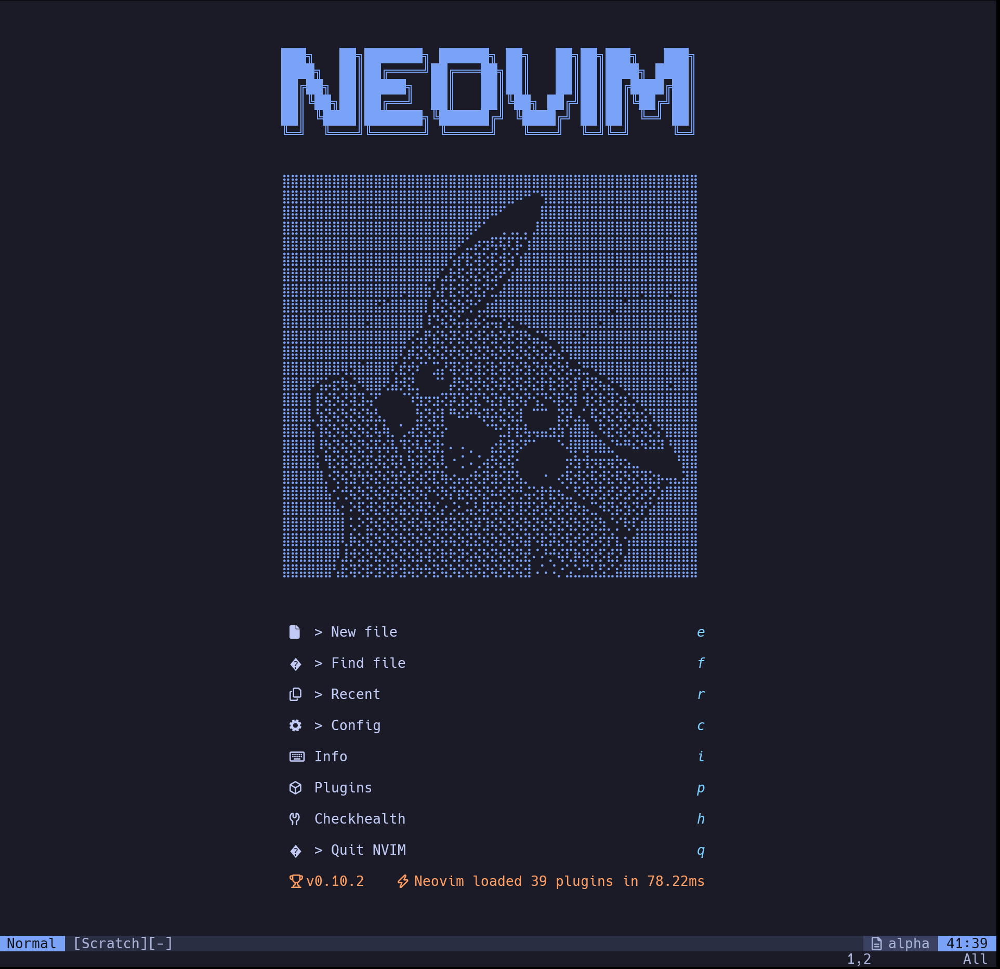
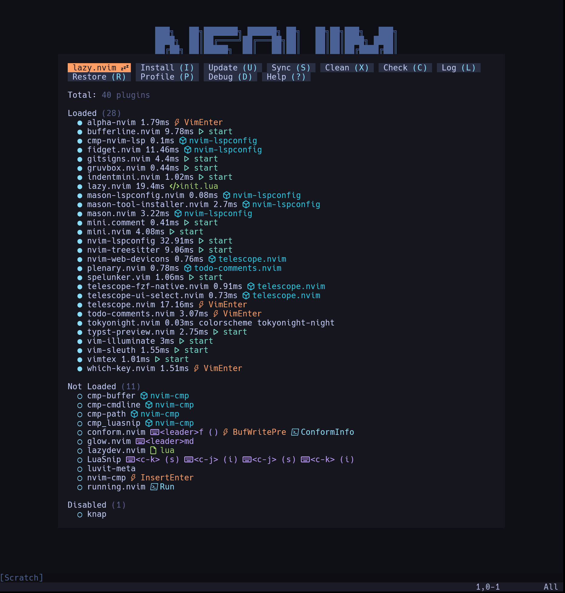
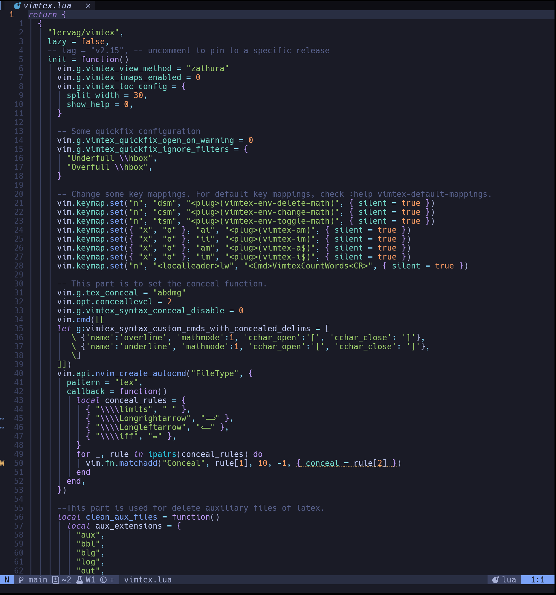

## Some screeningshots

## Main References
[kickstart.nvim](https://github.com/nvim-lua/kickstart.nvim), for general neovim configuration.

[A guide to supercharged mathematical typesetting](https://ejmastnak.com/tutorials/vim-latex/intro/), for LaTeX specific neovim configuration.

## Keyboard Mappings

`<leader> = <space>`

`<localleader> = <\>`

### 1. Basic

| Key             |  Action                                   | Mode               |
|-----------------|-------------------------------------------|--------------------|
| `<Esc>`           | stop highlighting the words               | n                  |
| `<leader>oq `     | open diagnostic quickfix list             | n                  |
| `<leader>cq`      | close diagnostic quickfix list            | n                  |
| `<Ctrl-h>`        | Move focus to the left window             | n                  |
| `<Ctrl-l>`        | Move focus to the right window            | n                  |
| `<Ctrl-j>`        | Move focus to the lower window            | n                  |
| `<Ctrl-k>`        | Move focus to the upper window            | n                  |
| `gf`              | go to file                                | n                  |
| `:cc`             | jump to the offending line                | quickfix           |

### 2. mini.comment
| Key | Action                             | Mode |
|-----|------------------------------------|------|
| `gc`  | comment and uncomment a code block | x    |
| `gcc` | comment and uncomment a line       | n    |

### 3. conform (auto_formatter) 
| Key         | Action              | Mode                           |
|-------------|---------------------|--------------------------------|
| `<leader>f`   | auto formatting     | n                              |

- Currently, it only supports `lua` and `python`. we can add more formatter at conform.lua.

### 4. mini.surround (text-object)
- See 

### 5. obsidian 

- MacOS users need pngpaste (brew install pngpaste) for the :ObsidianPasteImg command (<leader>op).
- Change the _relative path_ of the vaults in obsidian.lua.

### 6. installing lsp and other tools by mason

- put the lsp under the table of the variable `servers`
- put other tools (e.g. formatters) under the table of mason-tool-installer.
- re-open nvim and all the tools will be installed automatically.
- :Mason to check the status of the tools.

### 7. upgrade/uninstall plugins

- :Lazy

### 8. Chinese input supports
- [Require additonal commandline tools](https://github.com/keaising/im-select.nvim?tab=readme-ov-file)
- These commandline tools (im-select/macism) ensure that the input method is English.
- For editing LaTeX files, choose ChineseArticle.tex or ChineseBeamer.tex as the template. They contain the magic comments:"%!TEX program = xelatex" and "%!TEX view = sioyek". The second one is not essential and one should delete it if the OS doesn't have sioyek been installed.

