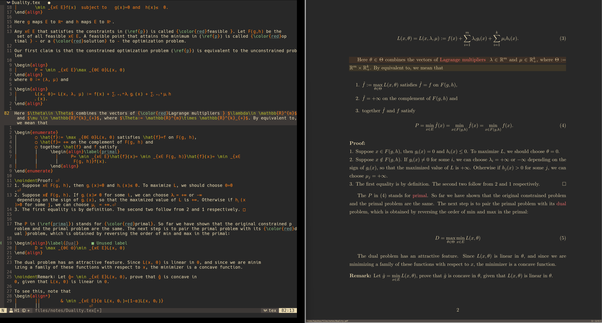
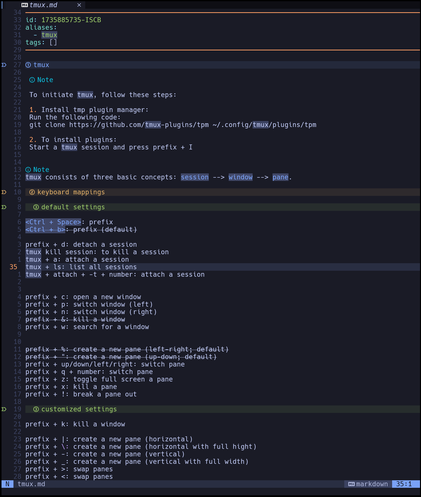

## Some screeningshots







## Main References
[kickstart.nvim](https://github.com/nvim-lua/kickstart.nvim), for general neovim configuration.


[A guide to supercharged mathematical typesetting](https://ejmastnak.com/tutorials/vim-latex/intro/), for LaTeX specific neovim configuration.


## Keyboard Mappings

`<leader> = <space>`

`<localleader> = <\>`

### 1. Basic

| Key             |  Action                                   | Mode               |
|-----------------|-------------------------------------------|--------------------|
| `<Esc>`           | stop highlighting the words               | n                  |
| `<leader>oq `     | open diagnostic quickfix list             | n                  |
| `<leader>cq`      | close diagnostic quickfix list            | n                  |
| `<Ctrl-h>`        | Move focus to the left window             | n                  |
| `<Ctrl-l>`        | Move focus to the right window            | n                  |
| `<Ctrl-j>`        | Move focus to the lower window            | n                  |
| `<Ctrl-k>`        | Move focus to the upper window            | n                  |
| `<Ctrl-n>`        | Move to the next buffer                   | n                  |
| `<Ctrl-p>`        | Move to the previous buffer               | n                  |
| `<Ctrl-q>`        | Close the current buffer                  | n                  |
| `gf`              | go to file                                | n                  |
| `:cc`             | jump to the offending line                | quickfix           |

### 2. vimtex 

| Key             | Action                                                | Mode |
|-----------------|-------------------------------------------------------|------|
| `<localleader>ll` | compile the file in a continuous mode                 | n    |
| `<localleader>lk` | stop compiling                                        | n    |
| `<localleader>lx` | clean the auxiliary files (must stop compiling first) | n    |
| `<localleader>lt` | open table of contents                                | n    |
| `<localleader>lw` | count words                                           | n    |
| `d(c)se`          | delete (change) surrounding environments              | n    |
| `d(c)sc`          | delete (change) surrounding commands                  | n    |
| `d(c)sd`          | delete (change) surrounding delimiters                | n    |
| `d(c)sm`          | delete (change) surrounding math                      | n    |
| `tsc(e)`          | toggle starred commands and environments              | n    |
| `tsm`             | toggle inline and display math                        | n    | 
| `tsd`             | toggle surrounding delimiters                         | n    |
| `tsf`             | toggle surrounding fractions                          | n    |
| `%`               | move between matching delimiters                      | nxo  |
| `]]`              | jump to the next section                              | nxo  |
| `[[`              | jump to the beginning of the current section          | nxo  |
| `[(])m(M)`        | jump to the next (previous) environments              | nxo  |
| `[(])n(N)`        | jump to the next (previous) math zone                 | nxo  |
| `[(])r(R)`        | jump to the next (previous) frame                     | nxo  |
| `<localleader>lv` | forward search                                        | n    |
| `<Ctrl><Click>`   | inverse search (on Zathura)                           | n    |
| `<RightClick>`    | inverse search (on Sioyek)                            | n    |


- We can also customize the conceal rules at vimtex.lua.
- If you use Skim as the pdf reader (on Mac OS), you should open Skim and navigate to `setting > Sync` and select `PDF-Tex Sync Support`. Then set the `Preset` field to `Custom`, set the `command` field to `nvim`, and the `Arguments` field to 

```shell
--headless -c "VimtexInverseSearch %line '$file'"
```
After that use `<Cmd><Shift><Click>` to do the inverse search.


### 3. Luasnip

| Key       | Action                             | Mode                       |
|-----------|------------------------------------|----------------------------|
| <\`>tbf   | make the selected parts to be bold | x                          |      
| `<Ctrl-j>`  | choose the next choice node        | i (choice node is active)  |
| `<Ctrl-k>`  | choose the previous choice node    | i (choice node is active)  |


### 4. cmp (auto completion)

| Key     | Action                                                    | Mode |
|---------|---------------------------------------------------------- |------|
| `<Tab>`   | select the next item; go to the next snippet placeholder  | i    |
| `<S-Tab>` | select the previous item; go to the previous placeholder  | i    |
| `<CR>`    | expand the snippet; confirm the item                      | i    |
| `<Esc>`   |close the completion list                                  | i    |


### 5. The default spell checker

| Key     | Action                                                       | Mode         |
|-------- |--------------------------------------------------------------|--------------|
| `zs`      | toggle to enable/disable spell checker in the current buffer | n            |
| `z=`      | open a list of suggestions                                   | n            |
| `zg`      | add the word to the good-spell list                          | n            |
| `zug`     | undo zg                                                      | n            |
| `zw`      | mark word as wrong                                           | n            |
| `zuw`     | undo zw                                                      | n            |
| `]s`      | move to the next misspelled word                             | n            |
| `[s`      | move to the previous misspelled word                         | n            |


### 6. mini.comment
| Key | Action                             | Mode |
|-----|------------------------------------|------|
| `gc`  | comment and uncomment a code block | x    |
| `gcc` | comment and uncomment a line       | n    |


### 7. conform (auto_formatter) 
| Key         | Action              | Mode                           |
|-------------|---------------------|--------------------------------|
| `<leader>f`   | auto formatting     | n                              |

- Currently, it only supports `lua` and `python`. we can add more formatter at conform.lua.


### 8. telescope
| Key              | Action                         | Mode   |
|------------------|--------------------------------|--------|
| `<leader>/`        | search current buffer          | n      |
| `<leader>s/`       | search live grep in open files | n      |
| `<leader>sh`       | search help                    | n      |
| `<leader>sk`       | search keymaps                 | n      |
| `<leader>sf`       | search files                   | n      |
| `<leader>ss`       | search select telescope        | n      |
| `<leader>sw`       | search current word            | n      |
| `<leader>sg`       | search by grep                 | n      |
| `<leader>sd`       | search diagnostics             | n      |
| `<leader>sr`       | search resume                  | n      |
| `<leader>s.`       | search recent files            | n      |
| `<leader><leader>` | search existing buffers        | n      |
| `<leader>sn`       | search neovim config files     | n      |


### 9. mini.surround (text-object)
- nvim's built in text object commands has the following form:
  
  verb + select type + text object type 

| verb | select type | text object type                               |
|------|-------------|------------------------------------------------|
| v    | a (around)  | w (word)                                       |
| c    | i (inside)  | W (word omitting any characters except <space> |
| d    |             | s (sentence)                                   |
| y    |             | p (paragraph)                                  |
|      |             | surroundings                                   |
|      |             | t (html tag)                                   |
|      |             | f (function)                                   |

- There are more text object types provided by vimtex.

| Key  | Text object                              |
|------|------------------------------------------|
| c    | Latex commands (\textbf{})               |
| d    | delimiters ([])                          |
| e    | Latex environments (\begin{} ... \end{}) |
| m    | inline math ($...$)                      |
| P    | sections                                 |
| i    | items in _itemize_ and _enumerate_           |


- add/delete/replace surroundings (brackets, quotes, etc.

-- saiw):  [S]urround [A]dd [I]nner [W]ord [)]Paren
-- sd':    [S]urround [D]elete [']quotes
-- sr)':   [S]urround [R]eplace [)] [']


### 10. mini.file
| Key       | Action                                                    | Mode |
|-----------|-----------------------------------------------------------|------|
| `<leader>b` | open mini.file w.r.t. the current buffer                  | n    |
| `<leader>B` | open mini.file w.r.t. the current working directory       | n    |


### 11. obsidian 
| Key        | Action                            | Mode |
|------------|-----------------------------------|------|
| `<leader>on` | create a new note                 | n    |
| `<leader>of` | find a file in the current vault  | n    |
| `<leader>ob` | list all backlinks                | n    |
| `<leader>ol` | list all links                    | n    |
| `<leader>ot` | list all notes with the tag       | n    |
| `<leader>op` | past the image from the clipboard | n    |

- MacOS users need pngpaste (brew install pngpaste) for the :ObsidianPasteImg command (<leader>op).
- Change the _relative path_ of the vaults in obsidian.lua.


### 12. typst

| Key        | Action               | Mode |
|------------|----------------------|------|
| `<leader>tw` | typst watch          | n    |
| `<leader>tp` | typst preview        | n    |
| `<leader>ts` | typst slides preview | n    |


### 13. installing lsp and other tools by mason

- put the lsp under the table of the variable `servers`
- put other tools (e.g. formatters) under the table of mason-tool-installer.
- re-open nvim and all the tools will be installed automatically.
- :Mason to check the status of the tools.

### 14. upgrade/uninstall plugins

- :Lazy

### 15. Kicamon/running (run code)
- :Run


### Todo
